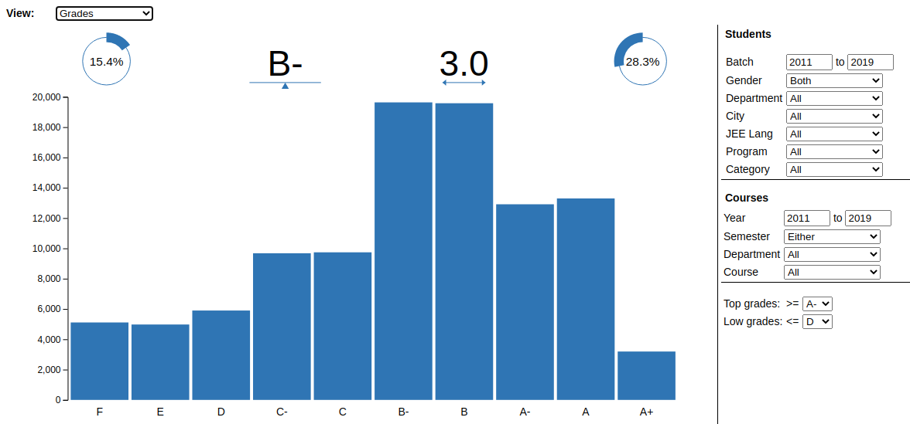
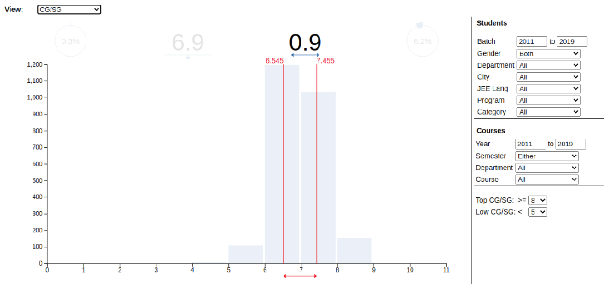
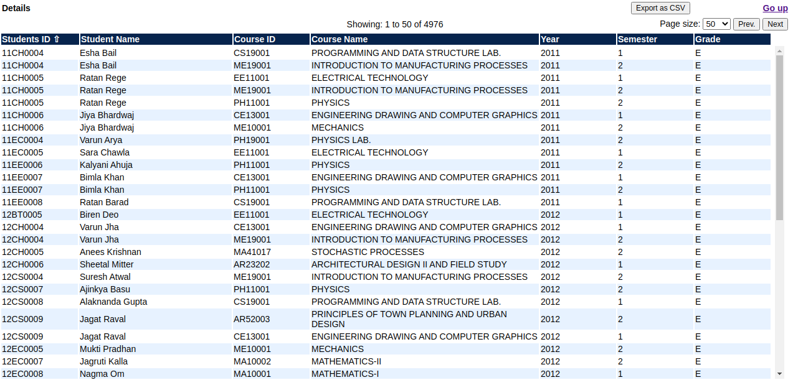
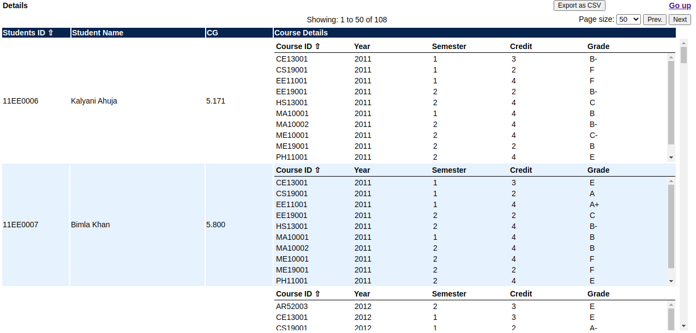

# Grades_Analyzer
Analyze grades of students

## Table of Contents
<ol>
   <li><a href="#head1"> Description of the project</a>
   <li><a href="#head2"> Libraries used </a>
   <li><a href="#head3"> Directory structure </a>
   <li><a href="#head4"> Usage </a>
   <li><a href="#head5"> Author </a>
</ol>


<h2 id="head1"> Description of the project </h2>

Helps in analyzing grades of students. Users can slice and dice the grades data by different parameters (gender, department, etc.) to understand relationship between parameters and grades. It further helps in identifying courses where grades have not been awarded properly (e.g. alotting a grade on C to every students). Identifying such relationships and anamolies can help academic offices take corrective actions.

Students names, grades and other details have been randomly generated for sample data. Course names have been taken from IIT Kharagpur courses page for different deparments. For e.g. AE (AEROSPACE ENGINEERING) courses are available [here](https://erp.iitkgp.ac.in/ERPWebServices/curricula/CurriculaSubjectsList.jsp?stuType=UG&splCode=AE).

<h2 id="head2"> Libraries used </h2>

<ul>
 <li> d3.js
</ul>

<h2 id="head3"> Directory structure </h2>

```
├── Resources                           # Folder to hold JS files
    ├── a_plus_grades_analyzer.js       # Main JS code for grades analysis 
    ├── courses.js                      # sample courses data
    ├── d3-v4.js                        # D3 v4 code
    ├── departments.js                  # sample departments data
    ├── grades.js                       # sample grades data
    ├── students.js                     # sample students data
├── Screenshots                         # Folder to hold screenshots
├── icon.png                            # Icon image   
├── index.html                          # Index HTML file
├── README.md                           # ReadMe file
├── LICENSE                             # Licdense file

```

<h2 id="head4"> Usage </h2>

On the home screen upload 4 CSV files for Departments, Courses, Students, and Grades. Or click on 'Load Sample Data' to work with sample data.


**Grades View**




**CG View with Inter Quartile Range**



Clicking on any grades bar, opens up the details of the grades.

**Grades Detail View**



Clicking on any CG/SG bar, opens up the details of the CG/SG.

**CG Details View**




<h2 id="head5"> Author </h2>

[Shahzeb Akhtar](https://www.linkedin.com/in/shahzebakhtar/)
